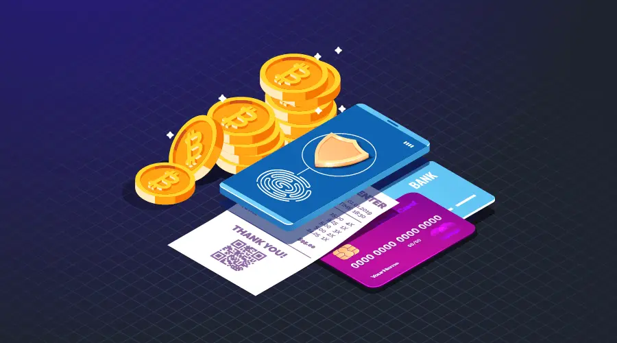

# វិធី៦យ៉ាងដែលអ្នកអាចប្រើប្រាស់ Bitcoin

អ្នកប្រហែលជាដឹងហើយថា Bitcoin ជាប្រភេទរូបិយប័ណ្ណឌីជីថល់ដែលល្បីជាងគេ ហើយមានតំលៃខ្ពស់ជាងគេក្នុងទីផ្សារ។ សូម្បីតែនៅកម្ពុជាក៏ចំនួនអ្នកប្រើប្រាស់វាកំពុងតែកើនឡើងជារៀងរាល់ថ្ងៃ ហើយមនុស្សជាច្រើនទៀតក៏ចាប់ផ្តើមយល់ពីផលប្រយោជ៍របស់វា។

ក៏ប៉ុន្តែ[ការរកទិញ Bitcoin នៅកម្ពុជា](https://daix.co/trade) មិនសូវជាងាយស្រួលប៉ុន្មាននោះទេ ដោយសារតែប្រព័ន្ធ KYC ដែលស្មុគស្មាញ រួមជាមួយច្បាប់ហួសសម័យដែលហាមឃាត់មិនអោយមានការជួញដូរវានៅក្នុងស្រុក។ តែនៅពេលដែលអ្នកទទួលបានវាក្នុងកាបូបរបស់អ្នកផ្ទាល់ តើអ្នកអាចយកវាទៅធ្វើអ្វីខ្លះ?

ខាងក្រោមនេះ យើងនឹងនិយាយពីវិធី៦យ៉ាងដែលអ្នកអាចប្រើ Bitcoin បាន។

### ផ្ងើ Bitcoin

ដូចនឹងការផ្ងើប្រាក់រៀលរបស់អ្នកពីគណនេយ្យធនាគាររបស់អ្នកទៅមនុស្សម្នាក់ទៀត អ្នកក៏អាចផ្ងើ Bitcoin បានដូចគ្នាដែរ។

ផ្ញើ Bitcoin មានភាពងាយស្រួល និងរហ័សជាង ជាពិសេសពេលអ្នកផ្ញើទៅក្រៅស្រុក។ វិធីនេះមានចំនុចល្អច្រើនជាងវិធីបុរាណមួយចំនួនដូចជា Western Union និង ការផ្ទេរតាមធនាគារ។

ចំនុចល្អទាំងនោះមានដូចជា៖

- Bitcoin មានលក្ខណៈជា Peer 2 Peer ដូចនេះបញ្ញើមិនត្រូវការឈ្មួញកណ្តាល។
- អ្នកទទួលអាចនឹងទទួលបានប្រាក់ភ្លាមៗ មិនចាំបាច់ចាំដល់ច្រើនថ្ងៃ ឬ ច្រើនសប្តាស៍។
- ផ្ញើនិងទទួលបានរៀងរាល់ថ្ងៃ និង គ្រប់ពេលវេលា។
- គ្មានព្រំដែនកំនត់ អ្នកអាចផ្ងើ Bitcoin បានទៅគ្រប់ទីកន្លែងលើពិភពលោកអោយតែមានភ្ជាប់ជាមួយអុីនធឺណិត។
- គ្មានថ្លៃឈ្នួលបន្ថែម។

### ចាយ bitcoin

ការចាយតាមរយៈ Bitcoin ផ្តល់អត្ថប្រយោជន៍មួយលើសពីការចាយប្រាក់ធម្មតា។ ចំនុចនោះគឺ តាមរយៈ Bitcoin លោកអ្នកអាចធ្វើប្រតិបត្តិការប្រាក់អ្នកជាលក្ខណៈអនាមិក។ នេះមានន័យថា បើសិនជាអ្នកធ្វើតាមក្បួនត្រឹមត្រូវ នោះអ្នកអាចធ្វើការទិញទំនិញដោយមិនចាំបាច់បង្ហាញអត្តសញ្ញាណផ្ទាល់របស់អ្នក។ ហេតុនេះហើយទើបវាមានការពេញនិយមខ្លាំងនៅក្នុងគេហទំព័រងងឹត (Dark Web) កាលពីវាទើបកើតដំបូង។

មុខងារពិសេសមួយទៀតសំរាប់ខាងអាជីវករ​​​​​​ នោះគឺពុំមានតំលៃសេវាកម្ម​ រឺមួយក៏ការបង្ឃាំងទុកប្រាក់នោះទេ។​​ នៅពេលដែលប្រតិបត្តិ​ Bitcoin បានបញ្ចប់រួចរាល់​ អ្នកផ្ញើនឹងមិនអាចត្រលប់ប្រតិបត្តិការនោះវិញទេ។

### ខ្ចី Bitcoin

ក្នុងប្រព័ន្ធខ្ចីប្រាក់បែបបុរាណមានភាគីខ្ចី និងភាគីដែលអោយប្រាក់ខ្ចី។ ការខ្ចី Bitcoin ក៏មានលក្ខណៈស្រដៀងគ្នានេះដែរ។ បើអ្នកមាន Bitcoin ក្នុងកាបូបដែលមិនប្រុងនឹងប្រើប្រាស់ក្នុងរយៈពេលមួយ អ្នកអាចដាក់ឱ្យគេខ្ចីដើម្បីទទួលបានការប្រាក់។ អ្នកអាចដាក់ឱ្យអ្នកមានចំណាប់អារម្មណ៍ខ្ចីបានក្នុងរយៈពេលមួយដែលយល់ស្របពីភាគីសងខាង។

សំរាប់ Bitcoin មានចំនុចកណ្តាលមួយដែលធានាសុវត្ថិភាពដល់ប្រតិបត្តិការប្រាក់រវាងភាគីទាំងពីរ។ ក៏ប៉ុន្តែក៏មានដំណោះស្រាយដែលពុំមានចំនុចកណ្តាលកំពុងនឹងត្រូវគេធ្វើឡើងអោយប្រើប្រាស់ជាមួយ
<a href="https://blockgeeks.com/guides/ethereum/" target="_blank">Ethereum</a>.

ដំណោះស្រាយទាំងនេះត្រូវបានគេអោយឈ្មោះថា Decentralized Finance រឺក៏ DeFi ។ ការរកឃើញថ្មីនេះធ្វើអោយប្រប័ន្ធបណ្តាញដែលគ្មានចំនុចកណ្តាលអាចផ្លាស់ប្តូរវិធីខ្ចីទៅជាការដំនើរការមួយមានតម្លាភាពហើយមិនត្រូវការឈ្មួញនៅកណ្តាល។ នេះដោយសារតែវាប្រើប្រាស់កិច្ចសន្យាមានភាពឆ្លាតវៃមាននៅលើ Ethereum ប្រព័ន្ធនេះអាចនឹងរីកកាន់តែធំ ហើយអាចដំនើរការបានប្រសិទ្ធភាពជាងប្រព័ន្ធដែលយើងប្រើសព្ធថ្ងៃ។
<a href="https://blockonomi.com/what-is-decentralized-finance-defi/" target="_blank">Decentralized Finance</a>

មានមនុស្សជាច្រើនយល់ថា DeFi នឹងក្លាយជាឆ្អឹងខ្នងរបស់ប្រព័ន្ធហិរញ្ញវត្ថុថ្មី។

### ជួញដូរ Bitcoin

Bitcoin ត្រូវបានគេប្រើក្នុងការជួញដូរញឹកញាប់ជាងគេបំផុត។ វាស្រដៀងទៅនឹងការជួញដូរ Forex ដែរ គោលការណ៍ទូទៅគឺ ទិញតំលៃទាប លក់ចេញតំលៃខ្ពស់។

មានវិធីជួញដូរ៣ប្រភេទដែលត្រូវគេនិយមប្រើប្រាស់ដើម្បីអោយបានចំនូលខ្ពស់។ វិធីជួញដូរ Bitcoin មានដូចជា Day Trading, Scalping, និង Swing Trading។ <a href="https://99bitcoins.com/bitcoin-trading/#trading_types" target="_blank">Bitcoin trading types</a>

**Day trading:** យុទ្ធសាស្រ្តក្នុងការជួញដូរប្រភេទនេះ គឺត្រូវចេះរកឱកាសឱ្យបានច្រើនដោយពឹងផ្អែកលើការស្មាន និងការវិភាគលក្ខណៈបច្ចេកទេស ដើម្បីបានចំនេញក្នុងពេលខ្លីពីទីផ្សារបច្ចុប្បន្ន។ ជាទូទៅ អ្នកជួញដូរប្រភេទនេះធ្វើការជួញដូរច្រើនដងរៀងរាល់ថ្ងៃ ដំបូងចូលក្នុងទីផ្សារ រកទីតាំងជួញដូរ តាមដានទីតាំងនោះឱ្យជាប់ រួចហើយចាកចេញវិញនៅពេលមានចំនេញ។

**Scalping:** វិធីនេះទាក់ទងនឹងការតាមដានការផ្លាស់ប្តូរតំលៃបន្តិចបន្តួចដើម្បីទទួលយកចំនេញច្រើន។ វាជាវិធីដែលមានរយៈពេលខ្លី ដែលអ្នកជួញដូរប្រភេទនេះអាចដាក់ជួញដូររាប់រយដងក្នុងមួយថ្ងៃ រួចយកចំនេញតែបន្តិចពេលតំលៃផ្លាស់ប្តូរ។ Scalping ជាវិធីជួញដូរដែលមានសុវត្ថិភាពជាងគេដោយសារតែវាមានរយៈពេលខ្លី។

**Swing Trading:** Swing Trading: ខុសពី Scalping និង Day Trading, Swing Trading គឺជាវិធីជួញដូររយៈពេលយូរដែលមិនត្រូវការយើងតាមដានស្ថានភាពទីផ្សារជាប់រហូត។ អ្នកជួញដូរប្រភេទនេះអាចកាន់ជំនួញជាប់ដៃជាច្រើនសប្តាហ៍ ឬច្រើនខែ មុននឹងបិទជំនួញនេះ។ អ្នកជួញដូរប្រភេទនេះចូលទីផ្សារ រកទីតាំងជួញដូរ រួចចាំការឡើងថ្លៃរហូតដល់ចំនុចមួយ ដែលខ្លួនចង់បាន ទើបចាកចេញវិញ។

**WARNING!** ប្រយ័ត្ន! ការជួញដូរ Forex អាចមានហានិភ័យខ្លះ តែការជួញដូរ Bitcoin មានហានិភ័យកាន់តែខ្ពស់។ នេះដោយសារតែការប្រែប្រួលខ្លាំងក្នុងទីផ្សារ។ ដូចនេះ បើអ្នកមិនមែនជាអ្នកមានបទពិសោធន៍ជំនួញ ឬ អ្នកលេងល្បែងទេ ការជួញដូរ Bitcoin ប្រហែលជាមិនសាកសមនឹងអ្នកទេ។

ពេលខ្លះវិធីដែលប្រសើរបំផុត គឺមិនធ្វើអ្វីទាំងអស់។ នៅក្នុងសហគមន៍ Crypto គេហៅវិធីនេះថា HODL ដែលជាពាក្យគេប្រើដើម្បីជំរុញម្ចាស់ Bitcoin មិនអោយចំនាយទ្រព្យសម្បត្តិឌីជីថលរបស់ពួកគេ។

ជាធម្មតាយើងគ្រាន់តែសន្សំ Bitcoin ទុកក្នុងកាបូបហើយសង្ឃឹមថាវានឹងឡើងថ្លៃកាន់តែយូរទៅ។ អ្នកវិនិយោគដែលឆ្លាតវ័យ និងមានបទពិសោធន៍ច្រើនជឿថាតំលៃ Bitcoin នឹងឡើងគុណពី១០ ទៅ ១០០ដង ក្នុងពេល៥ឆ្នាំ។

### យក Bitcoin ទៅវិនិយោគ

គោលដៅចំបងក្នុងការវិនិយោគអ្វីក៏ដោយ គឺដើម្បីបង្កើនបរិមាណហិរញ្ញវត្ថុ។ ខុសពីការជួញដូរ ការវិនិយោគត្រូវការពេលវេលាច្រើន និងការអត់ធ្មត់ខ្ពស់។

វិធីមួយក្នុងយក Bitcoin ទៅវិនិយោគគឺយកវាទៅទិញកាក់ប្រភេទផ្សេង ឬមួយក៏ដូរជា Token។

ប្រយ័ត្ន! មានក្រុមបោកប្រាស់មួយចំនួន ដែលបោកបញ្ឆោតមនុស្សដើម្បីយកប្រាក់ញើសឈាមរបស់ពួកគេ។ ការបោកប្រាស់អាចមានច្រើនប្រភេទ។ វិធីដែលគេនិយមប្រើជាងគេគឺ Ponzi Schemes និង ការប្រូម៉ូតកាក់ដែលគ្មានតំលៃ (Shitcoin)។

វិធីដែលគេស្គាល់ថាជា Ponzi Scheme នោះធ្វើឡើងដោយសន្យាជាមួយអ្នកវិនិយោគថានឹងរកចំនូលឱ្យពួកគេវិញបានច្រើនមិនគួរអោយជឿក្នុងរយៈពេលខ្លី។ ឧទាហរណ៍មួយនៃ Ponzi Scheme <a href="https://bitcoinist.com/mining-max-pyramid-scheme-comes-crashing-down/" target="_blank">Mining Max</a>. ក្រុមអះអាងថាអាចរុករកកាក់បានត្រូវបានចាប់ខ្លួននៅប្រទេសកូរ៉េខាងត្បូងបន្ទាប់ពីបោកប្រាស់អស់ ២៥៦លានដុល្លារ ពីអ្នកវិនិយោគ ១៨,០០០នាក់។

Shitcoins ដោយឡែកវិញជាប្រភេទរូបិយប័ណ្ណឌីជីថល ដែលគ្មានតំរូវការប្រើប្រាស់ ឬ មុខងារផ្លែកដោយឡែកពីគេ។ ម្ចាស់ Shitcoin ច្រើនតែបំផ្លឹសពីកាក់ទាំងនេះឱ្យមានគេទិញ។ ក្រោយមក កាក់ទាំងនោះនឹងធ្លាក់ថ្លៃខ្លាំងដោយវាមានកំហុស និងគ្រឹះមិនច្បាស់លាស់។ ឧទាហរណ៍មួយគឺ OneCoin ដែលម្ចាស់កាក់នេះលួចប្រាក់បាន ៤.៤ពាន់លានដុល្លារ ពីអ្នកវិនិយោគជុំវិញពិភពលោក។
<a href="https://fortune.com/2019/11/06/is-onecoin-the-biggest-financial-fraud-in-history/" target="_blank">Link</a>

### បរិច្ចាក Bitcoin

អ្នកអាចបរិច្ចាក bitcoin ទៅនឹងកម្មវិធីអ្វីមួយក្នុងចំនោមកម្មវិធីសប្បុរសធំ៍ទាំងអស់នេះ។ គំរូក្នុងការបរិច្ចាកទៅក្នុងកម្មវិធីអ្វីមួយដោយប្រើ Bitcoin ផ្តល់នូវចំនុចល្អទៅដល់អ្នកបរិច្ចាក ក៏ដូចជាអ្នកទទួល។

ការបរិច្ចាកនេះមានចំនុចល្អប្រសើរ៤យ៉ាង ជាងការបរិច្ចាកបែបបុរាណ៖

- អ្នកទទួលអាចទទួលការបរិច្ចាកពីមនុស្សទូទាំងពិភពលោកដោយមិនត្រូវការតំលៃសេវាថែម។
- ប្រតិបត្តិការប្រាក់រហ័ស និងស្រួលជាងមុន។ មិនចាំបាច់ចំនាយពេលនៅក្នុងធនាគារដើម្បីរង់ចាំការត្រួតពិនិត្យប្រតិបត្តិការនីមួយៗ។
- ការតាមដានប្រាក់មិនមានការវៀចវេរ។
- ការបរិច្ចាកដោយអាណាមិក។

### សរុបសេចក្តី

រូបិយប័ណ្ណឌីជីថល គឺស្ថិតនៅក្នុងសភាពក្មេងខ្ចីនៅឡើយ។ ទោះបែបនេះក្តី តំលៃ Bitcoin និង Ethereum បានឡើងដល់រាប់រយ រាប់ពាន់ដុល្លារក្នុងពេលត្រឹមប៉ុន្មានឆ្នាំ។ នេះគឺគិតត្រឹមថាបច្ចេកវិទ្យាយើងសព្វថ្ងៃនៅមានកំរិត និងមិនទាន់ទូលំទូលាយនៅឡើយផង។

ថ្វីបើការប្រើប្រាស់រូបិយប័ណ្ណឌីជីថល មានច្រើនមិនអាចប្រកែកបាន នៅសល់ពេលយូរទៀតទំរាំយើងអាចប្រើវាបានដល់ជិតអស់សមត្ថភាពរបស់វា។ នៅពេលនោះ យើងលែងអាចញែកវាចេញពីជីវិតយើងបានហើយ ដូចទៅនឹងអុីនធឺណិត និងទូរស័ព្ទវ័យឆ្លាតសព្ធថ្ងៃ។
