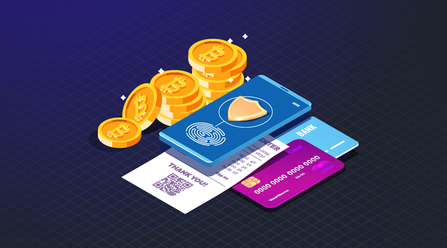

# 6 Things you can do with Bitcoin

You probably already know that Bitcoin is the most popular cryptocurrency with the highest market cap. Even in Cambodia, the number of Bitcoin users keeps increasing every day, and more and more people are beginning to see it's unique potential.

Yet it is not easy to [get Bitcoin in Cambodia](https://daix.co), mostly due to complicated KYC verification and outdated laws that prohibit exchanges from operating within the country. But once you have some Bitcoin in your wallet, what can you do with them?

Here, we will go into six different things you can do with Bitcoin.

### Sending Bitcoin

Just like sending Cambodian Riel from your bank account to another person, it is also possible to send bitcoin.

Sending Bitcoin can be cheaper and faster, especially when you’re sending across borders. This method has many advantages over traditional solutions like Western Union and bank transfers.

A few of these advantages are:

- Bitcoin is peer to peer, so it eliminates the middlemen.
- The recipient receives the funds almost instantly — no need to wait for days.
- Send and receive on any day of the week, at any time of the day.
- No border limitation. You can send Bitcoin anywhere in the world with an internet connection.
- No chargebacks.

### Spending Bitcoin

Spending Bitcoin offers you a unique advantage over traditional spending. For instance, with Bitcoin, you can make anonymous transactions. This means - if you follow <a href="https://coinsutra.com/anonymous-bitcoin-transactions/" target="_blank">proper practice</a> - you can make purchases without revealing your real identity. This is one of the reasons that it became so popular on the dark web in its early days.

Another unique feature (mainly for merchants) is that you can be sure that there will be no chargebacks or frozen funds. Once a Bitcoin transaction is confirmed, which usually takes 1-30 minutes, there is no way for the sender to revert that transaction.

### Lending Bitcoin

In the traditional financial loan system, there's a borrower and a lender. Bitcoin lending works somewhat the same way. So if you have Bitcoin in your wallet that you're not planning on using for some time, you can earn interest by lending it out. You can lend to interested borrowers over an agreed duration of lending and on agreed rates.

For Bitcoin, there are centralized solutions in place to secure all transactions between the borrower and the lender. However, decentralized solutions are being built on <a href="https://blockgeeks.com/guides/ethereum/" target="_blank">Ethereum</a>.

These solutions are known as <a href="https://blockonomi.com/what-is-decentralized-finance-defi/" target="_blank">Decentralized Finance</a> or DeFi. This innovation leverages decentralized networks to transform lending protocols into transparent procedures without any intermediary.

Some individuals believe that DeFi is about to become the backbone of the new financial system.

### Trading Bitcoin

Trading is one of the most common ways Bitcoin is used today. It works similar to Forex trading, and the general idea is to buy low and sell high.

There are three popular trading methods practiced by Bitcoin traders to maximize profit. <a href="https://99bitcoins.com/bitcoin-trading/#trading_types" target="_blank">Bitcoin trading types</a> include day trading, scalping, and swing trading.

**Day trading:** The main idea behind the day trading strategy is looking for opportunities - mostly based on speculations and technical analysis - to make short-term profits from the ongoing market. A typical day trader conducts multiple trades throughout the day; he enters the market, takes a position, keeps an eye on the positions, and then exits at a profit.

**Scalping:** Scalping involves monopolizing on small price changes to build substantial profits. A typical scalper can place hundreds of trades in a day, taking advantage of multiple minor changes in market price to create profits. Scalping is believed to be one of the safest methods of trading due to its short-term nature.

**Swing Trading:** Unlike scalping and day trading, swing trading is more of a long-term strategy that does not require constant monitoring of market movements. A typical swing trader could hold a trade for weeks or months before closing it. Swing traders enter the market, takes a position, and patiently wait for a gradual price increase. Once the price hits the desired spot, he then exits at a profit.

**WARNING!** Forex trading is risky, but Bitcoin trading is even more dangerous. This is due to the high volatility in the market. So if you're not an experienced trader or a gambler, Bitcoin trading is definitely not for you.

Sometimes the best thing you can do is not to take any action at all. In the crypto community, this is called 'hodl' – an expression used to encourage Bitcoin owners not to spend their digital assets.

You simply keep accumulating Bitcoin in your wallet, and hopefully, over time, the price will go up. Some astute and experienced investors believe the Bitcoin price will make 10-100x in price increase within the next five years.

### Investing Bitcoin

The primary aim of any investment plan is to increase financial capacity. But unlike trading, investment takes time and a lot of patience.

One way to reinvest your Bitcoin is by buying other coins or tokens on an exchange.

**WARNING!** Several fraudulent organizations are scamming people, ripping them of their hard-earned money. These scams have devised various methods of defrauding people. Ponzi schemes and worthless coin promotion (shitcoins) are popular methods.

These so-called investment ponzis would promise investors ridiculously high returns on their investment within the shortest time. For example, a popular Ponzi scheme is <a href="https://bitcoinist.com/mining-max-pyramid-scheme-comes-crashing-down/" target="_blank">Mining Max</a>. This self-acclaimed mining platform was caught in South Korea after it has ripped off about USD 250.6 million from 18,000 investors.

Shitcoins, on the other hand, are cryptocurrencies with no utility or unique features. Shitcoin owners often hype their coins to lure investors into buying them. Sooner or later, the value of the coins will depreciate due to flawed and unrealistic fundamentals. OneCoin is a typical example of a shitcoin. Its founders <a href="https://fortune.com/2019/11/06/is-onecoin-the-biggest-financial-fraud-in-history/" target="_blank">stole at least USD 4.4 billion</a> from its many investors all across the world.

### Donating Bitcoin

You can donate Bitcoin to a particular cause, such as one of these charities. The model of donating Bitcoin to a cause offers practical advantages both to the donor and the recipient.

Consider four benefits of donating Bitcoin for a cause over traditional ways:

- Gives the recipient access to a global audience of donors without extra transaction fees.
- Makes moving money across borders faster and easier. It eliminates the stress and time of waiting in the bank to verify each transaction.
- Funds tracking can be made without alterations.
- Anonymous donations.

### Conclusion

Cryptocurrency is still in its infancy. Even though Bitcoin and Ethereum have gone through a number of crazy bubbles in the past decade, we are still in the very early stage of technology and the days of early adopters.

While the possibilities of cryptocurrencies are undeniable, it will still take years until we get close to reaching their full potential. But once we do, we for sure won't be able to think them out of our life anymore, just like we can't today with the internet and smartphones.
