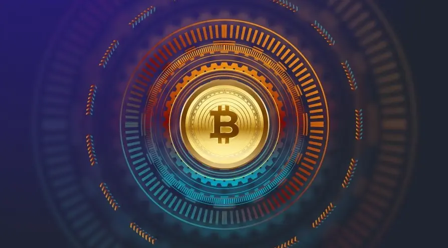

# តោះនាំគ្នាស្វែងយល់ខ្លះៗអំពី Bitcoin

## សួស្តីទាំងអស់គ្នា! 👋

បើអ្នកទើបនឹងចាប់ផ្តើមស្វែងយល់អំពីរូបិយប័ណ្ណឌីជីថល (Digital Currency) នោះអ្នកប្រហែលជាអាចជួបនឹងការលំបាកក្នុងការស្វែងយល់ពាក្យគន្លឹះ ដំនើរការផ្សេងៗ ក៏ដូចជាប្រភេទទ្រព្យឌីជីថលអ្វីខ្លះដែលមាន។ មិនបាច់បារម្ភទៀតទេ យើងនឹងណែនាំអ្នកពីរឿងទាំងនេះដូចខាងក្រោម។

### អ្វីទៅជារូបិយប័ណ្ណឌីជីថល (Digital Currency)?

និយាយសាមញ្ញទៅរូបិយប័ណ្ណឌីជីថល (Digital Currency) គឺជាប្រភេទមួយនៃទ្រព្យឌីជីថល។ ទ្រព្យឌីជីថលភាគច្រើនមានលក្ខណ **Decentralized** បានន័យថាគ្មានអង្គភាពណាមួយដែលគ្រប់គ្រងវាទាំងស្រុងទេ ហើយនេះជាលក្ខណពិសេសមួយរបស់វាដែលប្រសើរជាង**ក្រដាស់ប្រាក់។**

### តើរូបិយប័ណ្ណឌីជីថលដំណើរការដូចម្តេច?

ដោយសារតែរូបិយប័ណ្ណឌីជីថលមានលក្ខណៈ Decentralized ដូចនេះត្រូវមានក្បួនខ្លះសំរាប់ធានាថារាល់ប្រតិបត្តិការនៃទ្រព្យឌីជីថលធ្វើទៅបានត្រឺមត្រូវ។ **Blockchain** ផ្ទុករាល់ទិន្នន័យរបស់ប្រតិបត្តិការ ហើយតាមដានរាល់ប្រតិបត្តិការទ្រព្យឌីជីថលដែលកើតឡើងជុំវិញពិភពលោកជារៀងរហូត។

ប្រព័ន្ធនេះត្រូវបានការពារដោយ **Miners** ដែលតែងតែធ្វើការដោះស្រាយបញ្ហារបស់រាល់ប្រតិបត្តិការទាំងអស់ដើម្បីធានាបានភាពត្រឹមត្រូវ។ នៅពេលនរណាម្នាក់ចូលរួមក្នុងការដោះស្រាយនេះដោយប្រើឧបករណ៍ខ្លួនឯង គេនឹងទទួលបានកាក់បន្តិចដែលគេហៅថា **Block Reward**។

### ធ្វើម៉េចទើបខ្ញុំអាចចូលរួមបាន?

បើអ្នកចង់ទទួលបានទ្រព្យឌីជីថលផ្ទាល់ខ្លួន នោះអ្នកត្រូវទិញ Bitcoin ខ្លះដោយប្រើប្រាក់សុទ្ធ។ កត់សំគាល់ផងដែរថា អ្នកត្រូវមាន**អាស័យដ្ឋាន**កាបូប Bitcoin ផ្ទាល់ខ្លួនជាមុនសិន។ ដូចនេះ អ្នកត្រូវជ្រើសរើសប្រភេទកាបូបដែលអ្នកពេញចិត្តជាមុនសិន។

វិធីម្យ៉ាងទៀត គឺទទួលបានប្រាក់ខែជារូបិយប័ណ្ណឌីជីថល។ ការងារនេះរួមមានច្រើនមុខដូចជា ការសរសេរអត្ថបទ សរសេរកម្មវិធីកុំព្យូទ័រ ការងាររចនា ហើយការងារផ្សេងៗច្រើនមុខទៀត។

### និយមន័យពាក្យគន្លឹះ

មានពាក្យខាងលើដែលអ្នកប្រហែលជាមិនយល់ខ្លះដែលយើងបានដាក់អោយមានពុម្ភអក្សរដិតដើម្បីអោយអ្នកមកស្វែងយល់ដូចខាងក្រោមនេះ៖

- Decentralized - វត្ថុអ្វីមួយដែលមិនមានអង្គភាព ឬ អជ្ញាធរណាមួយអាចគ្រប់គ្រងបាន។ ក្រដាស់ប្រាក់ ជារូបិយប័ណ្ណដែលត្រូវបានគ្រប់គ្រងដោយអង្គភាព ឬ អជ្ញាធរណាមួយ ឧទាហរណ៍ដូចជា លុយដុល្លារ និង លុយអឺរ៉ូ។
- Blockchain - ប្រៀបដូចជាបញ្ជីមួយដែលកត់ត្រារាល់ប្រតិបត្តិការទាំងឡាយតាមលំដាប់។
- Miners - ឧបករណ៍ទាំងឡាយដែលផ្ទៀងផ្ទាត់ប្រតិបត្តិការដោយប្រើប្រាស់វិធីដោះស្រាយបែបទំនើប។
- Confirm - ការផ្ទៀងផ្ទាត់គឺត្រូវការចាំបាច់សំរាប់ប្រតិបត្តិការអោយបានជោគជ័យ។ កាន់តែមានការផ្ទៀតផ្ទាត់ច្រើន នោះកំរិតត្រឹមត្រូវរបស់ប្រតិបត្តិការកាន់តែខ្ពស់។ ការផ្ទៀងផ្ទាត់មានចំនួនតិច អាចបានន័យថាកាក់ដដែលត្រូវបានចាយផ្ទួនគ្នា។
- Block reward - ទ្រព្យឌីជីថលដែលផ្តល់ទៅអោយ Miners ដែលបានចូលរួមក្នុងប្រតិបត្តិការ។
- អាស័យដ្ឋាន -ក្រុមពាក្យមួយដែលមានលាយចំរុះគ្នារវាងលេខ អក្សរ និងសញ្ញាផ្សេងៗដែលវាមិនត្រូវដូចគ្នាជាមួយអាស័យដ្ឋានលើកាបួបផ្សេងទេ។ វាត្រូវបានគេប្រើដើម្បីផ្ញើទ្រព្យឌីជីថលឆ្លងកាត់បណ្តាញអោយដល់គោលដៅណាមួយ។ កាក់ផ្សេងគ្នាមានទំរង់អាស័យដ្ឋានផ្សេងគ្នាដែរ។

### កាក់ផ្សេងៗ

ទ្រព្យឌីជីថលមានច្រើនប្រភេទ តែប្រភេទដែលគេនិយមប្រើរួមមាន៖

- Bitcoin (BTC)
- Ethereum (ETH)
- Litecoin (LTC)
- Bitcoin Cash (BCH)
- Dogecoin (DOGE)
- Monero (XMR)

ដើម្បីរកមើលទ្រព្យឌីជីថលដែលមានទាំងអស់សូមចូលទៅកាន់ [Coingecko](https://www.coingecko.com/)

### ការប្រើប្រាស់ DAIX

DAIX ជាវិធីក្នុងការទិញរូបិយប័ណ្ណឌីជីថលនៅកម្ពុជាដែលមានភាពរហ័ស និងងាយស្រួល។ មិនចាំបាច់ត្រូវការបង្កើតគណនេយ្យ ឬ ក័៏ផ្ទៀងផ្ទាត់តាម KYC យើងធ្វើបែបនេះដើម្បីអោយនរណាក៏អាចប្រើសេវាកម្មយើងបាន។ នៅលើវិបសាយយើង យើងមិនកំនត់ទំហំទឹកប្រាក់ប្រតិបត្តិការ ហើយយើងផ្តល់ឯងជនភាពជូនអ្នកក្នុងកំរិតខ្ពស់។

### ខ្ញុំចង់ស្វែងយល់បន្ថែម

ពួកយើងចង់ជំរុញអោយអ្នករៀនអំពីរូបិយប័ណ្ណឌីជីថលអោយបានកាន់តែច្រើន ហេតុនេះទើបយើងព្យាយាមផ្តល់ពត៍មានអោយកាន់តែច្រើនតាមដែលយើងអាចធ្វើបាន។ យើងសូមណែនាំអ្នកអោយចូលមើលទំព័រចាប់ផ្តើមយើង [តាមនេះ](https://daix.co)។

បើអ្នកមានចម្ងល់បន្ថែម សូមចូលទៅកាន់ទំព័រ <a href="https://t.me/daixco" rel="noopener" target="_blank">Telegram</a> or <a href="https://m.me/daixcambodia" rel="noopener" target="_blank">Facebook</a>.
