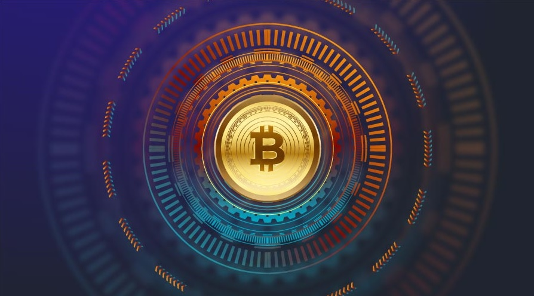

# Get a basic understanding of Bitcoin

## Welcome! 👋

If you are new to the digital currency space, it can be challenging to navigate all of the terms, concepts, and types of digital assets that are available. However, there is no need to worry! We are here to help you understand some of the basics.

### What is Digital Currency?

In simple terms, digital currency is a form of a digital asset. Most digital assets are **decentralized**, which means a single governing body does not control them, and this is what makes them more unique than the traditional **fiat**.

### How Does Digital Currency Work?

Since digital currencies are decentralized, some rules must exist to ensure that all transactions involving digital assets are legitimate. The **blockchain** stores all transaction data, chronologically tracking the public digital asset transactions taking place all over the world.

The network is secured by so-called **miners** who are constantly processing advanced computations to make sure all transactions are valid. When someone chooses to use their personal hardware to mine, they are issued a small number of coins called a **block reward**.

### How Do I Get Involved?

If you would like your very own digital assets, you will most likely need to purchase some bitcoins (BTC) using fiat. Remember, you will need to generate your own personal bitcoin **address** beforehand. To do so, you will need to find a wallet that you like.

Another option is getting paid in digital currency for your work. This can be done under anything ranging from writing articles, programming, designing, and many more.

### Definitions

Above, we have put some words in bold that you may not fully understand. We have defined them below:

- Decentralized - Something that has had power moved away from a specific authoritative body is decentralized.
- Fiat - Fiat currencies are centralized currencies, such as the U.S. Dollar or the Euro.
- Blockchain - The ledger that tracks digital asset transactions into sequential order.
- Miners - Computers that confirm transactions on the blockchain using a series of advanced computations.
- Confirm - Confirmations are necessary for a successful transaction. The number of confirmations is based on the number of times that the network has accepted the transaction. The more confirmations, the more likely the transaction is to be legitimate. The fewer the confirmations, the more likely it is that coins could potentially be double-spent.
- Block reward - New digital assets rewarded to a miner for participating in the mining process.
- Address - An address is an alphanumeric string of letters and numbers that is unique to a wallet. It is what is used to route digital assets across the network to a particular destination. Different coins have individual address formats.

### Different Coins

There are several digital assets that exist, but some of the most common are:

- Bitcoin (BTC)
- Ethereum (ETH)
- Litecoin (LTC)
- Bitcoin Cash (BCH)
- Dogecoin (DOGE)
- Monero (XMR)

To find a list of all currently active digital currency visit [Coingecko](https://www.coingecko.com/)

### Using DAIX

DIAX is a fast and straightforward way to purchase digital currency in Cambodia. There is no need to create an account or the need for KYC verification, we make it possible for everyone to use our services. On our platform, there are no transaction limits, and through our policies, we offer maximum privacy.

### I Want to Learn More

We encourage our users to learn as much about the digital currency world as possible, so we try to provide as much information as we can. If you are new to this space, we recommend you check out our other articles [here](https://daix.co).

If you have more questions, talk to us on <a href="https://t.me/daixco" target="_blank">Telegram</a> or <a href="https://m.me/daixcambodia" target="_blank">Facebook</a>.
