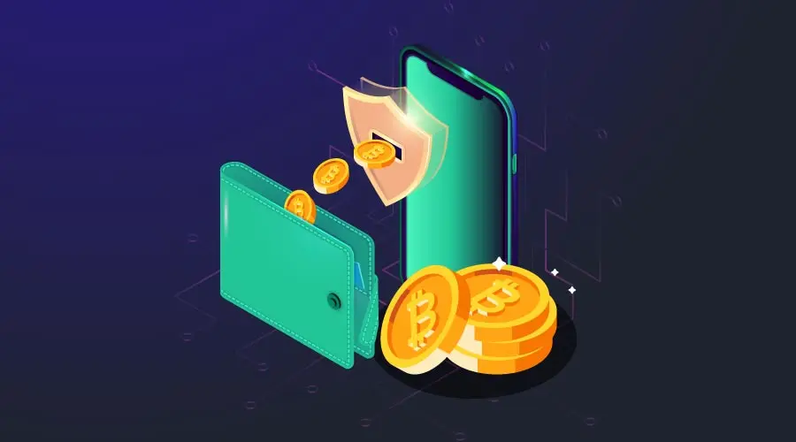

# អ្វីទៅជា Bitcoin wallet?

Bitcoin wallet គឺជាកាបូបលុយសំរាប់ផ្ទុក Bitcoin របស់អ្នក អ្នកត្រូវមានកាបូបលុយមួយទើបពួកយើងអាចផ្ញើ Bitcoin ទៅបានបន្ទាប់ពីអ្នកបានទិញរួចតាមរយៈ DAIX។ កាបូបនេះមានផ្ទុកព័ត៌មានដូចជា លេខសោសំងាត់ និង លេខសោសាធារណៈ (អាស័យដ្ឋានកាបូបរបស់អ្នក) ដែលអាចអោយអ្នកធ្វើប្រតិបត្តិការផ្សេងៗទាក់ទងនឹង Bitcoin។ កាបូបនេះមានប្រាំប្រភេទ៖ hardware, paper, desktop, web, និង mobile។

### Hardware Wallets

Hardware wallets គឺជាកាបូបដែលអ្នកត្រូវផ្ទុកនៅលើឧបករណ៍មួយ ហើយអាចប្រើប្រាស់បានលុះត្រាតែដោតភ្ជាប់ទៅនឹងកុំព្យូទ័រជាមុនសិន។ កាបូបប្រភេទនេះមានសុវត្ថិភាពជាងគេដោយសារតែវាអនុញ្ញាតិឱ្យអ្នកផ្ទុកលេខសោសំងាត់របស់អ្នកនៅក្រៅបណ្តាញអុីនធឺណិត។ កាបូបនេះមានជំរើសផ្សេងៗជាច្រើនម៉ាកហើយមានតំលៃទូទៅចាប់ពី ៥០ដុល្លារ ទៅ ១៥០ដុល្លារ។ បើអ្នកមានចំណាប់អារម្មណ៍ ពួកយើងសូមណែនាំម៉ាក Ledger Nano S និង Ledger Nano X ដោយសារតែពួកយើងប្រើប្រាស់វាផ្ទាល់ខ្លួនផងដែរ ហើយក៏អាចដឹកជញ្ជូនមកកម្ពុជាផងដែរ។ បើអ្នកមានចំណាប់អារម្មណ៍ ពួកយើងអាចណែនាំបាន សូមចុចទីនេះ។
<a href="https://shop.ledger.com/pages/ledger-nano-x?r=15966d90a8e2" target="_blank">ទីនេះ។</a>.

### Web Wallets

Web wallets គឺជាកាបូបដែលត្រូវបានផ្ទុកនៅក្នុងបណ្តាញរបស់គេហទំព័រណាមួយ។ កាបូបរបស់អ្នកនឹងទទួលបានការការពារពីប្រព័ន្ធសុវត្ថិភាពរបស់គេហទំព័រនោះ ហើយនឹងត្រូវបានភ្ជាប់ទៅបណ្តាញអុីនធឺណិតរាល់ពេលដែរ។ កាបូបប្រភេទនេះអាចជួបនឹងការវាយប្រហារញឹកញាប់ ប៉ុន្តែវាផ្តល់នូវភាពងាយស្រួលក្នុងការប្រើប្រាស់បានគ្រប់ពេលវេលាគ្រប់ទីកន្លែងតាមតំរូវការរបស់អ្នក។ គេហទំព័រដូចជា localbitcoins.com, coinbase.com និង bitpanda.com អាចអនុញ្ញាតឱ្យអ្នកបង្កើត web wallet ផ្ទាល់ខ្លួនបានយ៉ាងយាងស្រួល។

### Mobile Wallets

ប្រហាក់ប្រហែលទៅនឹង web wallet ដែរ mobile wallet ជាកាបូបដែលផ្ទុកនៅក្នុងកម្មវិធីមួយនៅលើទូរស័ព្ទដៃរបស់អ្នកផ្ទាល់។ បន្ថែមទៅលើការប្រើប្រាស់ទូរស័ព្ទរបស់អ្នកជាកាបូប Bitcoin អ្នកក៏អាចប្រើប្រាស់វាក្នុងការទូទាត់ប្រាក់នៅតាមរយៈភោជនីយដ្ឋានផ្សេងៗដែលគេទទួលយក Bitcoin ។ វាមានភាពងាយស្រួលខ្លាំងដោយគ្រាន់តែស្កេនកូត QR របស់ហាងនោះរួចចុចបញ្ជូន។ ដោយសារតែទូរស័ព្ទរបស់អ្នកភ្ជាប់ទៅកាន់បណ្តាញអុីនធឺណែតជាប់ជាប្រចាំ ពួកយើងសូមផ្តល់ការណែនាំថាមិនគួរទុក Bitcoin ច្រើនពេកនៅក្នុងនោះទេ។ មានកម្មវិធីជាច្រើនដែលមាននៅលើប្រព័ន្ធ Android និង iOS ទាំងពីរដូចជា Enjin Wallet, Samourai Wallet និង Mycelium Wallet។

### Paper Wallets

ជំរើសផ្សេងមួយទៀតក្រៅពី hardware wallet ដែលមិនចាំបាច់ចំនាយប្រាក់គឺបង្កើត paper wallet។ យើងអាចបង្កើត paper wallet បានដោយគ្រាន់តែព្រីនលេខសោសំងាត់ និងលេខសោសាធារណៈនៅលើក្រដាសមួយសន្លឹកតែប៉ុណ្ណោះ។ កាបូបប្រភេទនេះភាគច្រើនត្រូវបានព្រីនចេញជាលក្ខណៈកូត QR ដែលអាចអោយយើងប្រើប្រាស់បានរហ័សតាមរយៈការស្កេន។ ដូចនឹង hardware wallet ដែរ កាបូបនេះមានសុវត្ថិភាពខ្ពស់ប្រសិនបើមានការទុកដាក់ត្រឹមត្រូវ និងមិនប្រើជាមួយឧបករណ៍ដែលភ្ជាប់ទៅបណ្តាញអុីនធឺណែត។ គេហទំព័រដូចជា bitcoinpaperwallet.com and bitaddress.org អាចបង្កើតអាស័យដ្ឋាន Bitcoin ថ្មីឱ្យអ្នក រួមទាំងលេខសោសំងាត់ដែលអ្នកអាចយកទៅព្រីនចេញបាន។

### Desktop Wallets

បើអ្នកពុំសូវចូលចិត្តប្រើប្រាស់ក្រដាស់ អ្នកអាចសាកល្បងប្រើ desktop wallet វិញ។ Desktop wallet ជាកាបូបដែលផ្ទុកនៅលើកុំព្យូទ័រផ្ទាល់ខ្លួនរបស់អ្នក។ កាបូបនេះត្រូវបានរក្សាទុកនៅលើ hard drive របស់កុំព្យូទ័រអ្នក ដែលធ្វើអោយអ្នកមានការគ្រប់គ្រងពេញលេញទៅលើលេខសោសំងាត់ និង សោសាធារណៈរបស់អ្នក។ ទោះបីជាវាត្រូវបានផ្ទុកនៅលើ hard drive ក្តី ក៏ប៉ុន្តែកុំព្យូទ័ររបស់អ្នកអាចនឹងត្រូវបានភ្ជាប់ទៅកាន់បណ្តាញអុីនធីណិត ដែលអាចអនុញ្ញាតឱ្យកាបូបអ្នកទទួលការវាយប្រហារតាមប្រព័ន្ធអុីនធីណិត។ កាបូបមួយចំនួនដែលយើងអាចណែនាំអ្នកបានរួមមាន Electrum Wallet, Atomic Wallet និង Exodus Wallet។

ដោយហេតុថា Bitcoin មានតំលៃខ្ពស់ ការដែលអ្នកអាចរក្សាទុកវាបានមានសុវត្ថិភាពគឺពិតជាមានសារៈសំខាន់ណាស់។ សរុបសេចក្តីមក រាល់កាបូបទាំងអស់នេះ ពុំមានមួយណាដែលផ្តល់សុវត្ថិភាពបានឥតខ្ចោះនោះទេ ក៏ប៉ុន្តែរាល់ចំនុចខ្វះខាតដែលពួកវាមាន វាផ្តល់មកវិញជាមុខងារពិសេសៗ និងភាពងាយស្រួលក្នុងការប្រើប្រាស់ផ្សេងៗទៀត។ កាបូបនីមួយៗមានមុខងារដោយឡែកពីគ្នា ហើយជំរើសកាបូបរបស់អ្នកគួរសមស្របទៅតាមតំរូវការប្រើប្រាស់ Bitcoin ផ្ទាល់ខ្លួនរបស់អ្នកដែរ។
