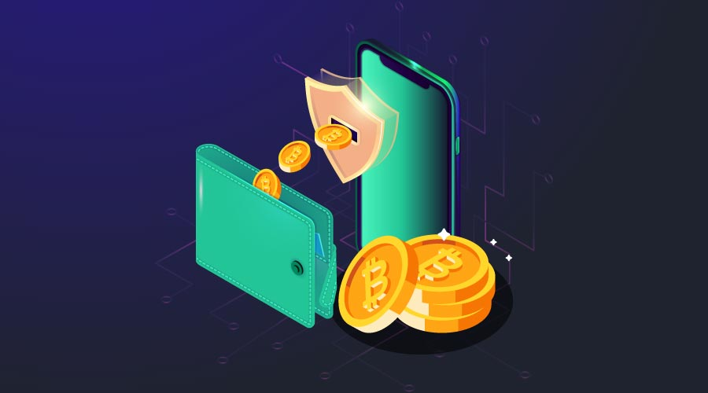

# What is a Bitcoin wallet?

A Bitcoin wallet is a wallet for your Bitcoin, and you will need one so that we can send you your Bitcoin after you have purchased them on DAIX. It stores information such as your private key and public key (your address) that allows you to make transactions and receive Bitcoin. There are five types of wallets: hardware, paper, desktop, web, and mobile.

### Hardware Wallets

Hardware wallets are wallets that are stored on a device, only accessible by being plugged into a computer. This is the safest type of wallet as it allows you to keep your private keys completely offline. There are multiple types from a variety of brands, with some costing around \$50 - 150. If you are looking to buy one, we can recommend getting a Ledger, as we have used them extensively ourselves, and they also ship to Cambodia. For our referral link, you can click <a href="https://shop.ledger.com/pages/ledger-nano-x?r=15966d90a8e2" target="_blank">here</a>.

### Web Wallets

A web wallet is a wallet that is stored on the server of a website. Your wallet will be secured behind the website’s securities while always having it online. These types of wallets are more vulnerable to attacks, but it provides access to your wallet from anywhere, anytime at your convenience. Websites such as Localcryptos.com, Coinbase.com and Localbitcoins.com will allow you to set up your very own web wallet as well as buy and sell BTC, Ethereum and more.

### Mobile Wallets

Like a web wallet, a mobile wallet is a wallet that is stored within an app on your mobile device. In addition to using your mobile wallet to store Bitcoin, you can also use it for daily transactions such as paying at a restaurant. It is as simple as scanning the shop's QR-code with your phone and pressing send. Since your mobile device is connected to the internet, it’s not recommended to store large amounts of Bitcoin on a mobile device that is connected to the internet. Multiple wallet apps are available on both iOS and Android, such as **Enjin Wallet**, **Samourai Wallet**, and **Mycelium Wallet**.

### Paper Wallets

A free alternative to the hardware wallet is creating a paper wallet. A paper wallet contains a public address and a private key printed on a piece of paper. Most of these wallets have them printed out in the form of a QR code, allowing for quick access through a scan. Just like a hardware wallet, these wallets are very safe as long as it is stored correctly and not used with any devices that are connected to the internet. Websites such as bitcoinpaperwallet.com and bitaddress.org can generate a random Bitcoin address for you along with a private key that you can print out.

### Desktop Wallets

A desktop wallet is essentially a wallet stored on your personal computer. The wallet is saved on your hard drive, giving you full control of your public key and private key. Even though it is stored on your hard drive, it can still connect to the internet, which puts your wallet at risk of cyber theft. A few examples of wallets that we can recommend are **Electrum Wallet**, **Atomic Wallet**, and **Exodus Wallet**.

Since Bitcoin is highly valuable, you must be able to keep them secured. That being said, not all of these wallets provide the most security for your Bitcoin, but for what they lack, they make up with their features and accessibility. Each wallet serves a specific purpose, and what you choose should correspond to how you will use your Bitcoin.
